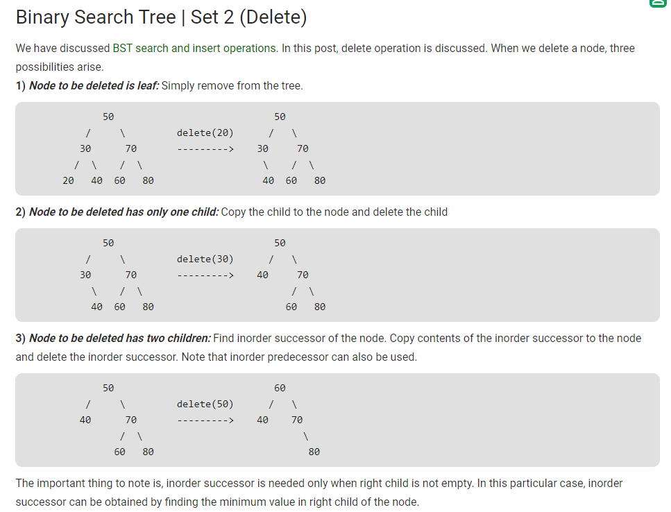

# Binary search tree

[Derek Banas part1](https://www.youtube.com/watch?v=M6lYob8STMI)

[geeksforgeeks Delete Node](https://www.geeksforgeeks.org/binary-search-tree-set-2-delete/)

    addNode
    Traversal
        inOrder
        preOrder
        postOrder
    findNode

    delete Node

